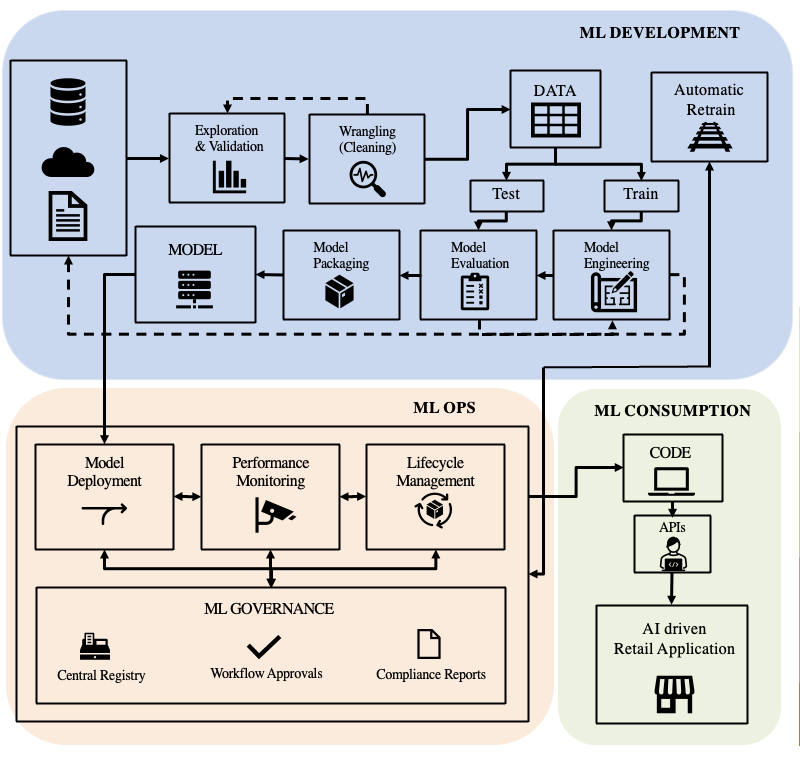

# Streamlining Machine Learning Lifecycle to Improve Retail Sales Performance Using MLflow

## Abstract

Organizations leveraging machine learning seek to streamline their machine learning development lifecycle. Machine learning model development possesses additional new challenges as compared to the traditional software development lifecycle. These include tracking experiments, code & data versioning, reproducing results, model management, and deployment. This paper aims to describe the implementation of MLflow on Azure databricks to streamline the process of building a recommender system to predict the user preference for a product or the likelihood of the user purchasing a product, given they are targeted with coupons in a promotional campaign. Finally, the entire machine learning pipeline is integrated with Flask using Rest API to
serve the model on real-time and batch inferencing.

## Introduction

Understanding factors that affect coupon redemption is crucial to determining the success of a promotional campaign. This paper discusses how our client can use millions of past transactions and demographics data to improve promotional campaigns efficacy using advanced recommender systems. However, getting a model into the real-world concerns more than building it. Deployment of the model into production is essential to take full advantage of the produced machine learning (ML) model; still only 22% of companies that use ML have successfully deployed an ML model into production. This paper discusses building and streamlining an entire ML pipeline and deploying the end model using a flask container using MLOps principles.

## Architecture

